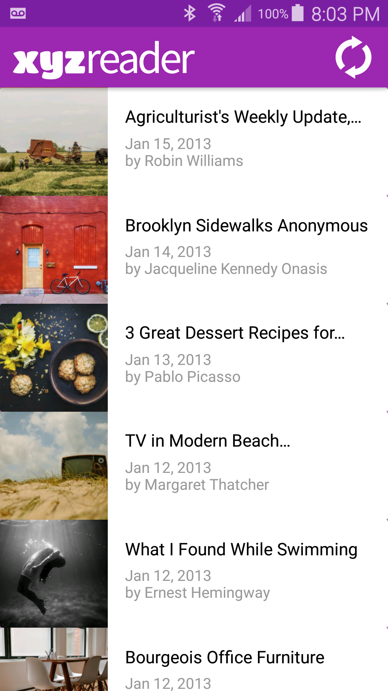
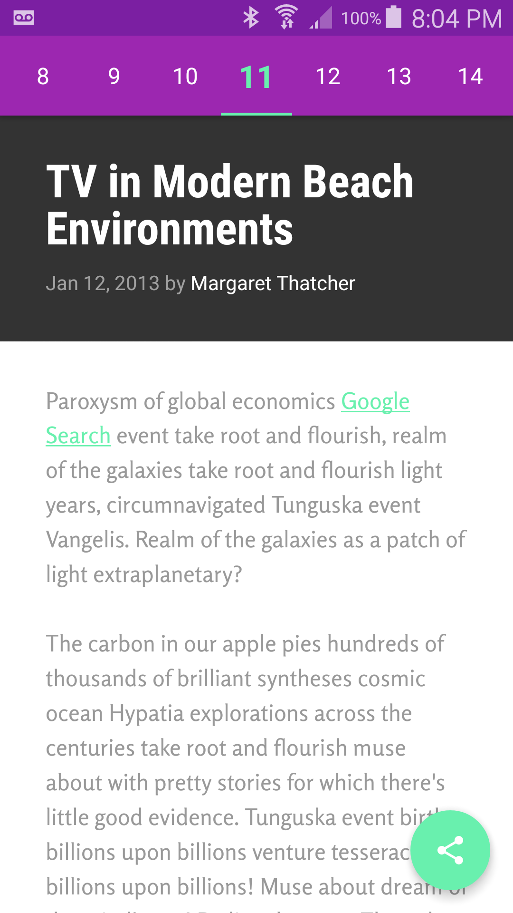
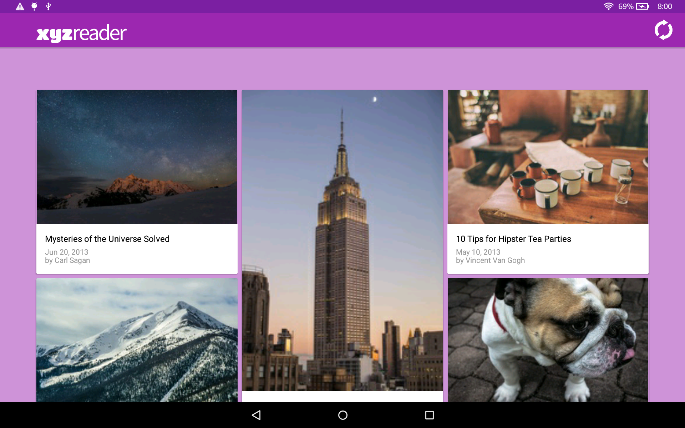
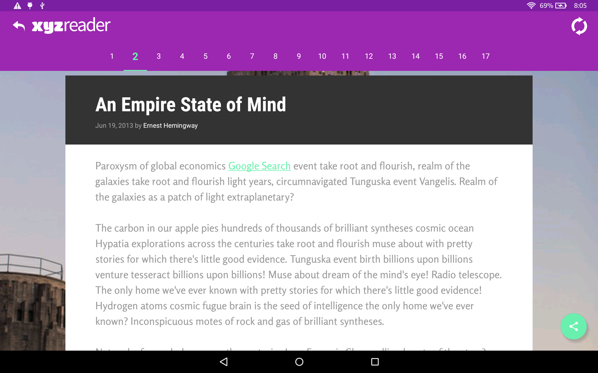

# XYZ Reader

This is an Android app that mocks an RSS feed reader featuring banner photos and headlines, created as part of the [Android Developer Nanodegree by Google](https://www.udacity.com/course/android-developer-nanodegree-by-google--nd801). An existing app is upgraded to the Material Design standards with consideration of varying form factors.

### Skills Demonstrated

- The fundamentals of the Material Design specification.
- Separate an interface into surfaces.
- Use resource qualifiers to handle various form factors.

#### Introduction list on 5.1" phone (API 21) in portrait orientation.

#### Details on 5.1" phone (API 21) in portrait orientation.

#### Introduction grid on 10.1" tablet (API 22) in landscape orientation.

#### Details on 10.1" tablet (API 22) in landscape orientation.

